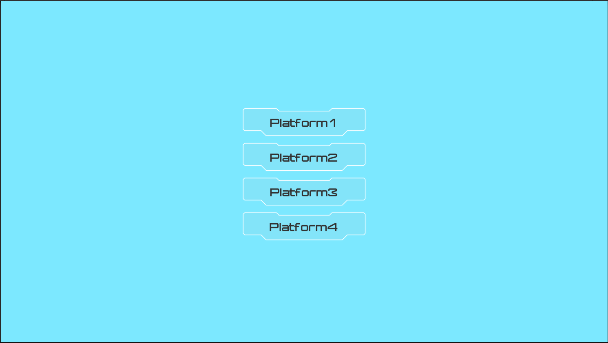
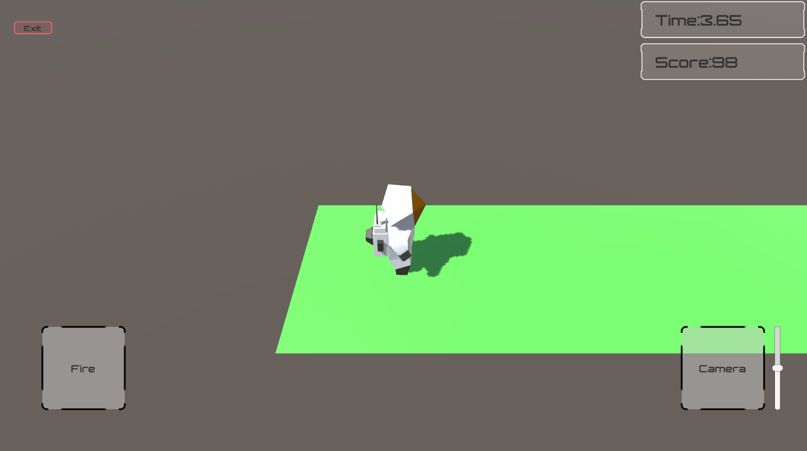

# Jump（触屏点击跳跃闯关游戏Demo）

该游戏包括五个场景（一个主界面四个游戏场景）

## 1.LaunchScene

进入游戏默认加载的场景，可以选择不同场景游玩

## 2.Platform1

**计分规则：**

1.到达终点时间越短得分越多

2.撞到障碍物扣分

**操作方式：**

1.点击路面后角色将会面向此方向并向前跳跃一定距离

2.点击“Fire”按钮可以发射子弹将方块撞出。

## 3.Platform2

**计分规则：**

1.到达终点时间越短得分越多

2.撞到障碍物扣分

**操作方式：**

1.点击路面后角色将会面向此方向并向前跳跃一定距离

## 4.Platform3

**计分规则：**

1.到达终点时间越短得分越多

2.撞到障碍物扣分

**操作方式：**

1.拖动摇杆控制角色运动

1.Jump按钮控制角色跳跃

## 5.Platform4

**计分规则：**

1.到达终点时间越短得分越多

2.撞到障碍物扣分

**操作方式：**

1.拖动摇杆控制角色运动

1.Jump按钮控制角色跳跃

## 使用素材

1.**[Jammo Character | Mix and Jam](https://assetstore.unity.com/packages/3d/characters/jammo-character-mix-and-jam-158456)**

2.**[Stylized Astronaut](https://assetstore.unity.com/packages/3d/characters/humanoids/sci-fi/stylized-astronaut-114298)**

3.**[UI Samples](https://assetstore.unity.com/packages/essentials/ui-samples-25468)**
